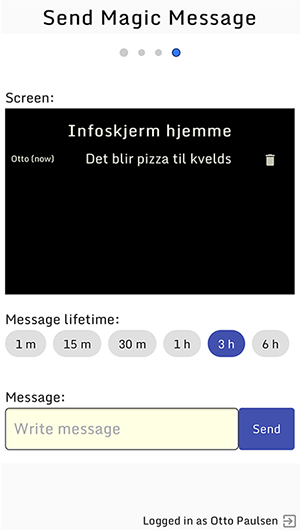

# MagicMessage Angular App



This is the Angular based app for my MMM-MessageToScreen module, which is a module for MagicMirror. See my [magic](https://github.com/ottopaulsen/magic) repository for more information.

The app is used to send messages to the magic mirror module.

I have two versions of the app. One made with Angular and one with React.

## Run locally

```
ng serve --open
```

## Initialize firebase

In order to deploy to Firebase hosting, you need to init firebase:

```
firebase init
```

Select project, set `dist` as the public directory and select `y` for single page app.


## Deploy

```
ng build --prod
firebase deploy --only hosting
```

